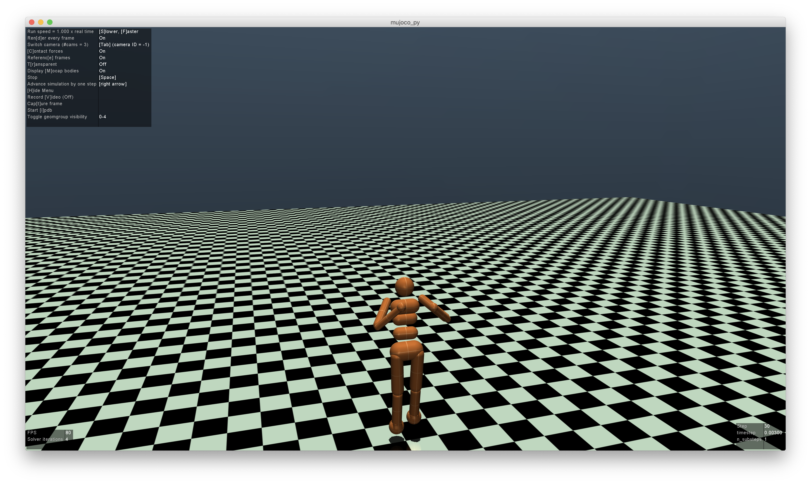

# RL-mujoco

RL-mujoco 는 Reniforcement Learning 과 openAI gym을 이용하여 로봇 시뮬레이션을 하기 위한 저장소입니다.

# Table of Contents
- [1. How to use openAI gym](#1-how-to-use-openai-gym)

- [2. Mujoco-py](#2-mujoco-py)

- [3. humanoid.py](#3-humanoidpy)


## 1. How to use openAI gym
우선 openAI gym을 설치하여야 합니다. (자세한 설명은 https://github.com/openai/gym 참고)

On OSX:
```{.bash}
foo@bar:~$ brew install cmake boost boost-python sdl2 swig wget
```

On Ubuntu 18.04:
```{.bash}
foo@bar:~$ apt install -y python3-dev zlib1g-dev libjpeg-dev cmake swig python-pyglet python3-opengl libboost-all-dev libsdl2-dev \
foo@bar:~$ libosmesa6-dev patchelf ffmpeg xvfb
```

openAI gym은 3D simulator로 MuJoCo를 사용하는데, python과 mujoco를 연결 해 주는 Mujoco-py가 윈도우에서 제대로 지원을 하지 않습니다.

설치 후에는 다음과 같은 코드로 python에서 openAI gym을 사용할 수 있습니다.

```python
import gym
env = gym.make('환경 이름')
env.reset()
env.render()
```

지원하는 환경은 다음 링크에서 확인할 수 있습니다.
https://gym.openai.com/envs/#classic_control


## 2. Mujoco-py
mujoco-py는 MuJoCo를 python에서 사용할 수 있도록 지원해주는 패키지입니다. (자세한 설명은 https://github.com/openai/mujoco-py#obtaining-the-binaries-and-license-key)

먼저 MuJoCo를 설치해야합니다. 다음 링크에 접속하여 설치하시기 바랍니다. (30일 라이센스 또는 학생 라이센스 사용)
https://www.roboti.us/license.html

### mujoco-py 설치
```{.bash}
foo@bar:~$ pip3 install -U 'mujoco-py<1.50.2,>=1.50.1'
```

## 3. humanoid.py
humanoid.py 는 openAI gym 환경 중 **Humanoid-v2** 환경을 이용합니다.
```python
import gym
from policygrad import PolicyGradient
env = gym.make('Humanoid-v2')
RENDER_ENV = False
RENDER_REWARD_MIN = 300
```

RENDER_REWARD_MIN 은 MuJoCo의 렌더링을 하기위한 최소 보상 값을 의미합니다. 아직 학습이 덜 되어 보상이 적은 경우에는 굳이 렌더링을 하여 자원을 낭비할 필요가 없으므로 최저 보상값을 지정 해 줍니다. 보상이 RENDER_REWARD_MIN을 넘게 되면 RENDER_ENV가 True가 되게 되어 3D 렌더링이 됩니다.  
에이전트의 학습에는 policygrad.py의 PolicyGradient 클래스를 이용합니다.  
학습이 진행되어 보상이 특정 값 이상이 될 경우, 다음과 같이 MuJoCo가 실행되어 에이전트의 행동을 확인할 수 있습니다.


